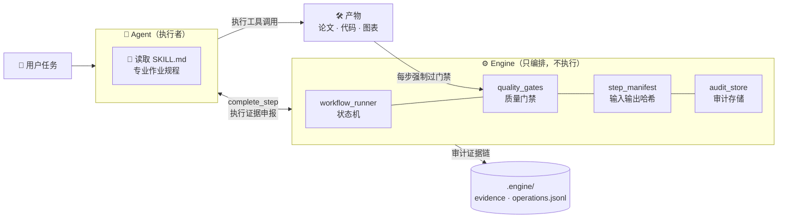

<div align="center">

# ⚗️ Academic Agent Toolkit

### 科研工具箱 · 让 Agent 像科研人员一样工作

*一套带质量门禁、审计证据链与溯源台账的科研 Agent 工程系统*

[](./CHANGELOG.md)
[](科研工具箱/tests)
[](capabilities/catalog.json)
[](科研工具箱/skills)
[](./LICENSE)
[](pyproject.toml)
[](#快速开始)

</div>

---

> [!TIP]
> **一句话**：给它一道竞赛题、一个研究任务或一份代码仓库，它按专业作业规程（245 个技能）自主完成
> 建模 → 编码 → 绘图 → 写作 → 审稿 → 编译 → 交付审计的全流程——**每一步产物可复现、可审计、可追溯**。

## ✨ 为什么不是又一个提示词合集

<table>
<tr><td width="50%" valign="top">

#### 🧠 技能即知识
每个 `skills/<name>/SKILL.md` 是一份**可执行的专业作业规程**——含工具调用、输出契约、门禁标准。Agent 读完后自主执行，而非等逐步指令。

</td><td width="50%" valign="top">

#### ⚙️ 引擎只编排
`engine/` 是状态机不是执行者：workflow 状态推进、质量门禁、STEP_MANIFEST 溯源、审计存储。**执行永远在 Agent，记忆永远在引擎。**

</td></tr>
<tr><td width="50%" valign="top">

#### 🚧 门禁保质量
页数、伴随文件、产物大小、审稿证据——每步产出强制过 named gates，**不达标自动重做**。论文里的图表没有数据来源？过不了 `figure_provenance` 门。

</td><td width="50%" valign="top">

#### 🔍 三层审计
L1 拦截式插件逐条记录每次工具调用（不可绕过）+ L2 编排留痕 + L3 执行申报，交叉比对让"伪造审核产物"无处遁形。

</td></tr>
</table>

## 🗺️ 六大能力域 · 269 项能力

| | 能力域 | 条目 | 代表能力 |
|--|--------|-----:|----------|
| 🎓 | **课程与研究材料** | 83 | 课程论文 · 实验报告 · 教学大纲 |
| 📝 | **学术论文** | 71 | 写作 · 评审 · 润色 · 投稿准备（含 Nature 工作流） |
| 🔬 | **文献与研究** | 41 | 文献检索 · 综述 · 深度研究 · 实验设计 |
| 🏆 | **数模竞赛** | 32 | CUMCM 14 步端到端流水线（10 项正式验收能力） |
| 📊 | **图表与文档生产** | 30 | 期刊级科研绘图 · 信息图 · Excalidraw · LaTeX 全家桶 |
| ©️ | **知识产权材料** | 12 | 软著申请（草稿→成品）· 专利交底书 · 基金申请书 |

<details>
<summary><b>📊 科研绘图栈（v1.1 新扩展，9 个上游技能）</b></summary>

<br>

| 层 | 技能 | 能做什么 |
|----|------|----------|
| 期刊规范 | `scientific-visualization` | 多面板布局 · 误差棒 · 显著性标注 · 色盲安全 · PDF/EPS/TIFF 导出 |
| 绘图库 | `matplotlib` `seaborn` `plotly` | 底层定制 · 统计图形 · 交互式图表 |
| 确定性图 | `figure-spec` `graphviz` `mermaid` | JSON→SVG 架构图 · 依赖图 · 流程图 |
| 编辑级图 | `diagram-design` | 39 类品牌图（Sankey/鱼骨/Wardley/UML/ER…）· 重绘 drawio/mermaid 源 · MIT |
| 视觉论证 | `excalidraw-diagram` `infographics` `scientific-schematics` | 手绘风论证图 · 信息图 · 科学示意图 |
| 既有沉淀 | `nature-figure` + 62 篇获奖论文实证规范 | Nature 级排版与配色 |

全部集成带 **pinned-commit 溯源**（`UPSTREAM.md` 台账 26 条，`tools/check_provenance.py` 一键校验）。

</details>

## 🏗️ 架构



## 🚀 快速开始

### OpenCode Desktop —— 正式宿主

```bash
git clone https://github.com/FOURTEEN1416/academic-agent-toolkit.git
```

用 [OpenCode Desktop](https://opencode.ai) 打开项目根目录 `D:\Desktop\数模竞赛` 即可——`opencode.json` 已配好默认角色（数模专家）、技能路径、docsearch MCP 与 4 个审稿 subagent。**不依赖 `opencode` CLI**（无需 CLI 在 PATH）。直接下任务：

> "按 CUMCM 流程做这道 2024 年 B 题，数据在 data/ 下，输出国一格式论文。"

### ZCode —— 兼容层

```bash
git clone https://github.com/FOURTEEN1416/academic-agent-toolkit.git
cd academic-agent-toolkit
cmd /c "mklink /J .zcode\skills 科研工具箱\skills"   # 重建技能联结（Windows）
```

打开仓库根目录：245 个技能自动发现、docsearch MCP 自动连接、`/doc-governance` 治理命令可用。

> [!NOTE]
> **宿主差异**：L1 拦截式审计插件仅 OpenCode 可用；ZCode 下审计为 L2+L3 两层，其余功能完全一致。

### 环境要求

`Python 3.11+` · `TeX Live / XeLaTeX`（编译类能力）· 可选：视觉 API（图表审查）、OpenRouter（infographics）

验证安装：

```bash
cd 科研工具箱 && python -m pytest -q        # → 225 passed
python tools/check_provenance.py             # → 26/26 UPSTREAM 台账通过
```

## 🛡️ 质量与可信

| 机制 | 一句话 |
|------|--------|
| 🚧 **Named Gates** | `paper_consistency` · `citation_integrity` · `experiment_reproduc` · `figure_provenance` · `compilation_log` |
| 🧾 **STEP_MANIFEST** | 每步记录输入/输出哈希、命令、配置、依赖——产物可复现 |
| 📜 **Provenance 台账** | 26 条 `UPSTREAM.md`（pinned commit + license），外部集成的每一行代码都能回答"从哪来" |
| 🎯 **双层基准集** | 公开基准（CC-BY-4.0）公开评测 · 私有基准（真实竞赛题面）内部压测 |
| ✅ **测试基线** | 225 项 pytest：状态机 / 门禁 / 桥接 / 审计 / 配置契约全覆盖 |

## 📁 仓库地图

```
academic-agent-toolkit/
├── 科研工具箱/     ★ 产品主体  skills(245) · engine(13) · tools(58+) · tests
├── capabilities/      能力目录 catalog.json —— 269 条，含验收证据与缺口声明
├── benchmarks/        公开基准集（CC-BY-4.0）
├── docs/superpowers/  设计 spec 与实施计划（dated 快照）
├── governance/        资产台账
├── AGENTS.md          Agent 入口：宿主矩阵 + 硬性规则
└── LOG.md             操作日志
```

<details>
<summary><b>🔖 版本与许可证</b></summary>

<br>

**v1.1.0（2026-08-28）** —— 全能力公开发布（含软著/专利/基金流水线）· 科研绘图 9 技能扩展 · ZCode 兼容层 · 全库文档治理（45+ 文档审计）。完整记录见 [CHANGELOG.md](./CHANGELOG.md)。

| 范围 | 许可证 |
|------|--------|
| 仓库核心（技能/工具/引擎/配置） | [CC-BY-NC-4.0](./LICENSE)（禁商用 · 禁 AI 训练） |
| 公开基准集 | CC-BY-4.0 |
| Vendored 第三方组件 | 随各自许可证，见各目录 `UPSTREAM.md` / `LICENSE` |

</details>

## 🙏 致谢

本项目的科研绘图与学术能力站在这些优秀开源项目的肩膀上（均为 pinned-commit 集成）：
[K-Dense-AI/scientific-agent-skills](https://github.com/K-Dense-AI/scientific-agent-skills) ·
[foryourhealth111-pixel/Vibe-Skills](https://github.com/foryourhealth111-pixel/Vibe-Skills) ·
[synthetic-sciences/openscience](https://github.com/synthetic-sciences/openscience) ·
[wanshuiyin/Auto-claude-code-research-in-sleep](https://github.com/wanshuiyin/Auto-claude-code-research-in-sleep) ·
[cathrynlavery/diagram-design](https://github.com/cathrynlavery/diagram-design) ·
[markdown-viewer/skills](https://github.com/markdown-viewer/skills) ·
[coleam00/excalidraw-diagram-skill](https://github.com/coleam00/excalidraw-diagram-skill) ·
[fanbuz/codesucker](https://github.com/fanbuz/codesucker)

---

<div align="center">

**联系方式**

[](tencent://message/?uin=1991401843)
[](https://github.com/FOURTEEN1416)

*如果这个项目对你有帮助，欢迎 ⭐ Star*

</div>
