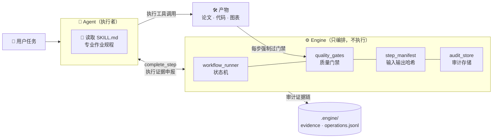

<div align="center">

# ⚗️ Academic Agent Toolkit

### academic-toolkit · 让 Agent 像科研人员一样工作

*一套带质量门禁、审计证据链与溯源台账的科研 Agent 工程系统*

[](./CHANGELOG.md)
[](academic-toolkit/tests)
[](capabilities/catalog.json)
[](academic-toolkit/skills)
[](./LICENSE)
[](#快速开始)
[](#快速开始)

</div>

---

> [!TIP]
> **一句话**：给它一道竞赛题、一个研究任务或一份代码仓库，它按专业作业规程（251 个随仓技能）自主完成
> 建模 → 编码 → 绘图 → 写作 → 审稿 → 编译 → 交付审计的全流程——**每一步产物可复现、可审计、可追溯**。

## ✨ 为什么不是又一个提示词合集

<table>
<tr><td width="50%" valign="top">

#### 🧠 技能即知识
每个 `skills/<name>/SKILL.md` 是一份**可执行的专业作业规程**——含工具调用、输出契约、门禁标准。Agent 读完后自主执行，而非等逐步指令。

</td><td width="50%" valign="top">

#### ⚙️ 引擎只编排
`engine/` 是状态机不是执行者：workflow 状态推进、质量门禁、STEP_MANIFEST 溯源、审计存储。**执行永远在 Agent，记忆永远在引擎。**

</td></tr>
<tr><td width="50%" valign="top">

#### 🚧 门禁保质量
页数、伴随文件、产物大小、审稿证据——每步产出强制过 named gates，**不达标自动重做**。论文里的图表没有数据来源？过不了 `figure_provenance` 门。

</td><td width="50%" valign="top">

#### 🔍 三层审计
L1 拦截式审计在**可选**宿主适配器（OpenCode 插件 / ZCode hook）就位时逐条记录工具调用；无宿主 hook 时 L1 如实降级为 unavailable。L2 编排留痕 + L3 执行申报始终可用，交叉比对让"伪造审核产物"无处遁形。

</td></tr>
</table>

## 🗺️ 六大能力域 + Agent 运行时 · 313 项能力

| | 能力域 | 条目 | 代表能力 |
|--|--------|-----:|----------|
| 🎓 | **课程与研究材料** | 83 | 课程论文 · 实验报告 · 教学大纲 |
| 📝 | **学术论文** | 75 | 写作 · 评审 · 润色 · 投稿准备（含 Nature 工作流） |
| 🔬 | **文献与研究** | 40 | 文献检索 · 综述 · 深度研究 · 实验设计 |
| 🏆 | **数模竞赛** | 37 | CUMCM 14 步端到端流水线 |
| 📊 | **图表与文档生产** | 63 | 期刊级科研绘图 · 信息图 · LaTeX |
| ©️ | **知识产权材料** | 12 | 软著 · 专利 · 基金申请书 |
| 🧩 | **Agent 运行时** | 2 | 宿主无关自举 · 自适应工具铸造 |

> 域表与 `capabilities/catalog.json` 对齐：37/75/41/83/12/63/2 = **313**（与徽章一致；2026-09-23 v2.0 W4 实测）。

> [!NOTE]
> **技能计数口径**（唯一）：徽章与正文统一为 `git ls-files` 口径的技能 SKILL.md 数（**clone 即所见**）；另有 5 个无 License 上游隔离件仅存本地、gitignored 不入库，不计入。

<details>
<summary><b>📊 科研绘图栈（v1.1 新扩展，9 个上游技能）</b></summary>

<br>

| 层 | 技能 | 能做什么 |
|----|------|----------|
| 期刊规范 | `scientific-visualization` | 多面板布局 · 误差棒 · 显著性标注 · 色盲安全 · PDF/EPS/TIFF 导出 |
| 绘图库 | `matplotlib` `seaborn` `plotly` | 底层定制 · 统计图形 · 交互式图表 |
| 确定性图 | `figure-spec` `graphviz` `mermaid` | JSON→SVG 架构图 · 依赖图 · 流程图 |
| 编辑级图 | `diagram-design` | 39 类品牌图（Sankey/鱼骨/Wardley/UML/ER…）· 重绘 drawio/mermaid 源 · MIT |
| 视觉论证 | `excalidraw-diagram` `infographics` `scientific-schematics` | 手绘风论证图 · 信息图 · 科学示意图 |
| 既有沉淀 | `paper-figure-nature` + 62 篇获奖论文实证规范 | Nature 级排版与配色 |

全部集成带 **pinned-commit 溯源**（`UPSTREAM.md` 台账 + vendor，`tools/check_provenance.py` 一键校验 75/75）。

</details>

## 🏗️ 架构



## 🚀 快速开始（宿主无关）

**任何能读文件、能执行 Python CLI 的 Agent 都可以驱动本项目**——Claude Code / Cursor / Gemini CLI / MiMo Desktop / OpenCode / ZCode / 自写脚本。

```bash
git clone https://github.com/FOURTEEN1416/academic-agent-toolkit.git
cd academic-agent-toolkit
python -m pip install -r requirements-dev.txt   # 第 0 步：测试/门禁依赖（在仓库根跑，别先 cd 进子目录）
cd academic-toolkit
python -m engine.workflow_cli boot
python -m engine.workflow_cli probe
```

1. 读仓库根 `AGENTS.md` 与 `academic-toolkit/AGENTS.md`
2. `boot` 取得驱动契约；`probe` 查看能力与 TOOL_GAP
3. 缺工具时 `python -m engine.workflow_cli forge --tool <name> --purpose "..."`
4. 竞赛/长流程：`start --template comp_cumcm` → `next` → 执行 → `complete`
5. 单技能：按路由表读 `skills/<name>/SKILL.md`

自举：`academic-toolkit/skills/agent-bootstrap/` · 铸造：`academic-toolkit/skills/tool-forge/`
适配器：协议不依赖；需要适配器元数据时 `python -m engine.workflow_cli forge --adapter <name>` 本地生成

> [!IMPORTANT]
> **路径卫生（PUBLIC 仓）**：tracked `opencode.json` 的 MCP `command` 与 `DOCSEARCH_ROOTS` 使用**可移植占位符**（`${DOCSEARCH_MCP_SERVER}` / `${DOCSEARCH_ROOTS}`）。docsearch MCP 装在宿主用户目录时，**操作员须在本地设置未提交的覆盖**；勿将 `C:\Users\...`、过期项目根路径写回 tracked 文件。宿主本地配置一律不入库。

直接下任务（任意 Agent）：

> "按 CUMCM 流程做这道 2024 年 B 题，数据在 data/ 下，输出国一格式论文。"

### 可选宿主适配器

| 适配器 | 用途 |
|--------|------|
| **OpenCode Desktop** | 打开仓库根即可用 `opencode.json`（默认角色数模专家 + skills 扫描 + subagent 内联）。**不依赖 `opencode` CLI** |
| **ZCode** | `cmd /c "mklink /J .zcode\skills academic-toolkit\skills"` 后打开仓库根；L1 hook 按本地未提交配置注册（契约见 `academic-toolkit/tests/test_zcode_host_compat.py` D 段） |
| **其他** | 无需专用配置，按上文协议驱动；需要适配器元数据时 `python -m engine.workflow_cli forge --adapter <name>` 本地重建 |

### 环境要求

| 级别 | 组件 | 用途 | 安装 |
|------|------|------|------|
| 必装 | Python 3.11+ | 全部能力 | python.org |
| 必装 | Python 依赖包 | 测试与门禁（pytest / pypdf / ruff 等） | `python -m pip install -r requirements-dev.txt`（**在仓库根执行**；ruff 版本锁死，勿单独升级） |
| 必装 | TeX Live / XeLaTeX | 论文编译类能力 | texlive.org |
| 推荐 | Graphviz（`dot`） | `graphviz` 技能 | `winget install --id Graphviz.Graphviz -e` |
| 推荐 | mermaid-cli（`mmdc`） | `mermaid-diagram` 技能 | `PUPPETEER_SKIP_DOWNLOAD=true bun install -g @mermaid-js/mermaid-cli`（用系统 Edge/Chrome 需写 puppeteer 配置，见技能内说明） |
| 可选 | **多模态 LLM 图像生成后端** | `infographics`、`scientific-schematics` 两个 AI 绘图专属技能 | `export OPENROUTER_API_KEY=sk-...` 或宿主原生 `generate_image` 后端；质量评审模型已按 2026-09-10 用户裁定配置（`engine/modex-core/contest_models.json`，四角色 agnes/agnes-2.5-flash） |

> [!IMPORTANT]
> **AI 绘图技能（infographics / scientific-schematics）必须有多模态 LLM 图像生成后端**——技能内置 Step 0 强制检测，缺后端会明确报错并给指引，不会用占位图冒充。其余绘图技能全部本地运行、零 API。

**一键体检**（本机能用哪些绘图技能、缺什么、怎么装）：

```bash
python academic-toolkit/tools/plotting_env_check.py
```

**验证安装**（两种 pytest 口径，唯一真源 = `pytest.ini` 注释）：

```bash
# 口径一（仓库根，回归门禁口径）：774 passed / 0 failed（与口径二同值）
python -m pytest -q
# 口径二（工具箱内，技能验收基线口径）：774 passed / 0 failed
cd academic-toolkit && python -m pytest -q
python tools/check_provenance.py             # → 75/75 UPSTREAM+vendor 台账通过
```

## 🛡️ 质量与可信

| 机制 | 一句话 |
|------|--------|
| 🚧 **Named Gates** | `paper_consistency` · `citation_integrity` · `experiment_reproduc` · `figure_provenance` · `compilation_log` |
| 🧾 **STEP_MANIFEST** | 每步记录输入/输出哈希、命令、配置、依赖——产物可复现 |
| 📜 **Provenance 台账** | UPSTREAM.md + vendor（pinned commit + license）75/75 校验通过（URL 源强制哈希级 Pinned commit），外部集成的每一行代码都能回答"从哪来" |
| 🎯 **双层基准集** | ⚠️ **2026-09-19 起停用**：公开层曾为 CC-BY-4.0 合成题面基准（P01-P03 + 六域 7 项），已废弃移除、不随仓库分发；私有层（真实竞赛题面）从未入库 |
| ✅ **测试基线** | 仓库根 **774 passed / 0 failed**（另 4 skipped：私有资料区缺位语义 skip 2 + docx_template_fill pyc 缺陷钉住 1 + 适配器元数据缺席 skip 1；仓库根与工具箱内同口径）。**唯一真源 = `pytest.ini` 注释**，历史基线演进也记录在该注释中；覆盖宿主无关协议（boot/probe/forge）、可选适配器、状态机/门禁/审计 |
| 🧬 **逐技能 C2 覆盖** | 技能 100% 登记 catalog 映射（schema 硬校验；含 agent-bootstrap / tool-forge 宿主无关能力）；真实执行证据为主，外部依赖项诚实标注 blocked-by-dependency，零伪造 |
| 🧩 **宿主无关协议** | `workflow_cli boot/probe/forge` + 旧宿主降为可选适配器 + TOOL_GAP→工具铸造（2026-09-20） |

## 📁 仓库地图

```
academic-agent-toolkit/
├── academic-toolkit/     ★ 产品主体  skills · engine · tools · tests
├── capabilities/      能力目录 catalog.json
├── SECURITY.md        安全策略
├── AGENTS.md          Agent 入口：宿主无关驱动协议 + 适配器矩阵
└── CHANGELOG.md       版本记录
```

<details>
<summary><b>🔖 版本与许可证</b></summary>

<br>

**v1.3.0（2026-09-22）** —— 宿主无关协议（boot/probe/forge + agents/adapters，旧宿主降为可选适配器）· 基线基础设施加固（secret_scan / lint_ratchet / duplicate_assets / 工具冒烟闸 + CI 加固）· 系统性升级五项（实战经验库 / 统一配色 / 技能触发审计）· 华为杯管线补齐（与国赛同构 14 步）· 四批并行收编。

**v1.2.0（2026-08-30）** —— 三条学术管线 C2 闭环 · 科研绘图域闭环。完整记录见 [CHANGELOG.md](./CHANGELOG.md)。

| 范围 | 许可证 |
|------|--------|
| 仓库核心（技能/工具/引擎/配置） | [CC-BY-NC-4.0](./LICENSE)（+ 附加限制：禁商用 · 禁 AI 训练） |
| 历史基准集（已于 2026-09-19 移除，不随仓库分发） | 曾以 CC-BY-4.0 发布 |
| Vendored 第三方组件 | 随各自许可证，见各目录 `UPSTREAM.md` / `LICENSE` |

</details>

## 🙏 致谢

本项目的科研绘图与学术能力站在这些优秀开源项目的肩膀上（均为 pinned-commit 集成）：
[K-Dense-AI/scientific-agent-skills](https://github.com/K-Dense-AI/scientific-agent-skills) ·
[foryourhealth111-pixel/Vibe-Skills](https://github.com/foryourhealth111-pixel/Vibe-Skills) ·
[synthetic-sciences/openscience](https://github.com/synthetic-sciences/openscience) ·
[wanshuiyin/Auto-claude-code-research-in-sleep](https://github.com/wanshuiyin/Auto-claude-code-research-in-sleep) ·
[cathrynlavery/diagram-design](https://github.com/cathrynlavery/diagram-design) ·
[markdown-viewer/skills](https://github.com/markdown-viewer/skills) ·
[coleam00/excalidraw-diagram-skill](https://github.com/coleam00/excalidraw-diagram-skill) ·
[fanbuz/codesucker](https://github.com/fanbuz/codesucker)

---

<div align="center">

**联系方式**

[](tencent://message/?uin=1991401843)
[](https://github.com/FOURTEEN1416)

*如果这个项目对你有帮助，欢迎 ⭐ Star*

</div>
