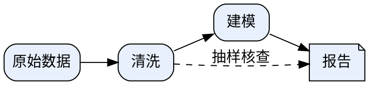

# Graphviz — relationship diagrams from DOT text

把"谁连接谁"写成几行 DOT 文本，Graphviz 负责把节点和边排布成一张可读的图。
文本即图源：可 diff、可版本控制、改一处重新渲染，不必手工拖拽。

## 什么时候用它

图的本体是**实体之间的拓扑关系**，而不是数值或视觉风格时，选这个技能：

- 依赖树、调用图、import/继承关系、包与模块层级；
- 流水线 DAG、审批链路、实验流程的状态转移；
- 证据链路、因果关系草图（论文 rebuttal / 审计叙事里常见）；
- 任何"节点 + 带方向的连线"能说清、手工排版很痛苦的结构。

## 什么时候用别的技能

| 需求 | 去处 |
|------|------|
| 实验数据画折线/柱状/热图等数值图 | paper-figure |
| 需要精确控制每个元素位置、按 JSON 规格产出可编辑 SVG | fig-spec |
| 品牌化信息图、演示型图示（配色和观感优先） | diagram-design |
| 先看别人怎么画、挑参考再动手 | agent-figure-gallery |

## DOT 一分钟上手

有向图用 `digraph`，边写 `->`；无向图用 `graph`，边写 `--`，两者不可混用：



要点：

1. 一条语句声明一个节点并给属性：`clean [label="清洗"];`；
2. 边语句只管连接：`a -> b;`，边属性跟在边后面 `[label="..."]`；
3. 含空格或特殊字符的名字用双引号包住当 ID；
4. 把一组节点圈进方框用 cluster：子图名字必须以 `cluster` 开头；
5. 让若干节点同层：放进 `{ rank=same; a; b; }`。

语法细节（record 形状、HTML 表格标签、箭头样式、间距参数、排错）见
[references/syntax.md](references/syntax.md)。

## 常见坑

- **属性和边写在同一条语句**：`a[label="x"] -> b` 不是合法 DOT。属性归属性语句，边归边语句。
- **cluster 忘写前缀**：`subgraph stage1` 只是一组节点，`subgraph cluster_stage1` 才画框。
- **HTML 标签没引号**：`label=<B>粗体</B>` 必须整体写成带引号的 HTML 字符串形式（见 syntax.md）。
- **渲染报错先看行号**：dot 的报错会指到具体行，通常是漏引号、漏分号、括号不配对三样。

## 渲染

```bash
dot -Tpng diagram.dot -o diagram.png    # 论文插图建议 -Tsvg 或 -Tpdf（矢量）
```

Windows 下 `dot` 常不在 PATH（安装器默认不勾选加入 PATH），先探测：

```bash
DOT=$(command -v dot || echo "/c/Program Files/Graphviz/bin/dot.exe")
"$DOT" -V
```

两处都找不到说明 Graphviz 未安装：`winget install --id Graphviz.Graphviz -e`，
或重跑安装器勾选 "Add Graphviz to PATH"。

## 产出契约

本步骤完成后必须经 `engine.step_manifest.write_manifest`（或 bridge/common 等价入口）
在工作区根目录写入 `STEP_MANIFEST.json`：stepName、backend（含 graphviz 版本 `dot -V`）、
config、inputFiles、outputFiles（含 SHA-256）、commands、dependencies 缺一不可，
否则步骤门禁不通过。DOT 源文件本身列入 outputFiles；图件须有来源证据
（figure_provenance 要求），建议把渲染命令原样记进 commands 字段。

## Related Files

- [references/syntax.md](references/syntax.md) — DOT 语法速查（独立编写）
- [references/UPSTREAM.md](references/UPSTREAM.md) — 溯源记录与 clean-room 声明
