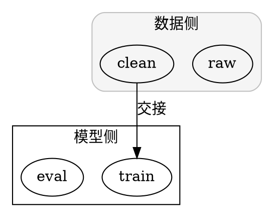

# DOT 语法速查（独立编写）

> 本文件为本仓独立创作的语法参考，面向驱动 agent 的高频需求；
> DOT 语言的权威定义见 Graphviz 官方文档（graphviz.org）。

## 文件骨架

```dot
digraph name {      // 有向图：边用 ->
  // 语句以分号或换行结尾；注释同 C 系：// 与 /* */，另支持行首 #
}
graph name2 {       // 无向图：边用 --
}
```

一个文件只描述一张图。`name` 可省略。

## 节点

### 声明与属性

首次出现在语句里即声明节点；属性用方括号，键值对逗号或空格分隔：

```dot
draft [label="初稿", shape=box, style=filled, fillcolor=lightgray];
review [shape=diamond];          // 只给形状
```

节点名（ID）规则：字母/数字/下划线组成且不以数字开头可裸写；
其余一律加双引号：`"2026 data" [shape=cylinder];`。

高频节点属性：

| 属性 | 作用 | 常用值 |
|------|------|--------|
| `label` | 显示文字（默认用节点名） | 任意字符串，`\n` 换行，`\l` 左对齐换行 |
| `shape` | 外形 | 见下方形状表 |
| `style` | 风格 | `filled` / `rounded` / `dashed` / `bold` / `invis`（可逗号组合） |
| `fillcolor` | 填充色 | 具名色或 `#RRGGBB` |
| `color` | 边框/线条色 | 同上 |
| `fontname` / `fontsize` | 字体 | Windows 中文常用 `fontname="Microsoft YaHei"` |
| `penwidth` | 线宽 | 数字，如 `2` |
| `width` / `height` / `margin` | 尺寸 | 英寸，如 `margin="0.2,0.1"` |

### record 形状（结构化节点）

`shape=record` 时 label 里的竖线 `|` 切分格子，尖括号定义端口供边挂接：

```dot
task [shape=record, label="<head> 任务卡|负责人: 张三|状态: 进行中"];
review -> task:head;             // 边接到 head 端口
```

字段内部想显示竖线或尖括号本体，用 `\"` `\<` `\>` 转义。
横向纵向混合布局用 `{ ... }` 包住纵向一组。

### HTML-like 标签（表格节点）

需要表格、粗体、多行混排时用 HTML 形式——label 的值整体放在引号内、
以 `<` `>` 包裹内部标签：

```dot
summary [label=<<TABLE BORDER="0">
  <TR><TD><B>结论</B></TD></TR>
  <TR><TD>模型 B 优于基线 <FONT COLOR="red">3.1%</FONT></TD></TR>
</TABLE>>];
```

支持常见子集：`<TABLE> <TR> <TD> <B> <I> <U> <FONT> <BR/> `。
注意：HTML 内的引号不需要转义（外层引号才是字符串边界），
`<` `>` 必须配对，否则解析失败。

## 边

### 基础与链式

```dot
a -> b;
a -> b -> c;          // 链式一次写完
{a b c} -> d;         // 集合简写：三条边
```

### 边属性

| 属性 | 作用 | 常用值 |
|------|------|--------|
| `label` / `taillabel` / `headlabel` | 边上文字 | 字符串；`taillabel`/`headlabel` 分别贴起/终点 |
| `style` | 线型 | `solid`（默认）/ `dashed` / `dotted` / `bold` / `invis` |
| `color` | 颜色 | 同节点；`color="red;0.5:blue"` 可分段配色 |
| `penwidth` | 线宽 | 数字 |
| `arrowhead` / `arrowtail` | 两端箭头 | `normal` / `empty` / `none` / `vee` / `diamond` / `dot` / `box` / `onormal` 等，可加 `o` 前缀变空心 |
| `dir` | 箭头方向开关 | `forward`（有向默认）/ `back` / `both` / `none` |
| `minlen` | 最短跨几层 | 整数，拉大间距用 |
| `constraint` | 是否参与分层 | `false` 让这条边不影布局（画辅助线常用） |
| `fontsize` / `fontcolor` | 边标签字号/颜色 | — |

## 布局控制

### 整体方向

`graph [rankdir=LR];` —— `TB` 自上而下（默认）、`LR` 左右、`BT`/`RL` 反向。

### 同层与定层

```dot
{ rank=same; step1; step2; }     // 两者同层
subgraph cluster_in { rank=same; a; b; }   // cluster 内同样可用
```

`rank=min` / `rank=max` 可把节点钉在最顶/最底层。

### 间距

```dot
graph [nodesep=0.5, ranksep=0.8];   // 同层间距 / 层间间距（英寸）
```

### 让某条边不参与排版

`a -> b [constraint=false];` —— 画回边、交叉引用时防止整张图被拽乱。

## cluster（分组框）



- 子图名必须以 `cluster` 开头才会画框；
- `ltail` / `lhead` 把边挂到整个框上（需 `compound=true`）；
- 框嵌套可用，但过深嵌套会牺牲可读性。

## 全局默认

```dot
node  [shape=ellipse, fontname="Microsoft YaHei"];
edge  [fontname="Microsoft YaHei", fontsize=10];
graph [rankdir=TB, splines=ortho];
```

默认值只影响**其后**声明的对象，习惯写在文件开头。
个别节点可再单独覆盖。

## 颜色写法

- 具名色：`red`、`lightblue`、`gray`、`transparent`（完整表见官方 colorscheme 文档）；
- 十六进制：`#RRGGBB`；
- 分段：边的 `color="red;0.3:blue"` 表示前 30% 红后 70% 蓝。

## 常用形状速查

| shape | 用途惯例 |
|-------|----------|
| `box` / `rect` | 过程、模块 |
| `rounded` 风格 box | 流程步骤 |
| `ellipse` / `circle` | 起止点、状态 |
| `diamond` | 判断分支 |
| `parallelogram` | 输入/输出 |
| `note` | 注释、报告 |
| `cylinder` | 数据库/存储 |
| `folder` / `tab` / `component` | 文件、页面、组件 |
| `record` / `Mrecord` | 结构化记录（Mrecord 圆角） |
| `point` / `plaintext` / `none` | 隐形/纯文字节点 |

## 无向图与布局引擎

`graph` 搭配 `--`。除默认 `dot` 引擎外，按结构选引擎：

| 引擎 | 适用 |
|------|------|
| `dot` | 分层 DAG（默认，流程/依赖首选） |
| `neato` / `fdp` | 力导向，网状/聚类结构 |
| `sfdp` | 大规模图（数千节点）的力导向 |
| `circo` | 环形布局（环状拓扑） |
| `twopi` | 径向布局（星型辐射） |

用法：`neato -Tsvg g.dot -o g.svg`。无向网络图先试 `sfdp`。

## 命令行覆盖与渲染选项

```bash
dot -Tpng g.dot -o g.png
dot -Tsvg g.dot -o g.svg            # 矢量，论文/网页首选
dot -Tpdf g.dot -o g.pdf            # LaTeX 直接 \includegraphics
dot -Grankdir=LR -Nfontname="Microsoft YaHei" g.dot -o g.png   # 不改源文件临时覆盖
dot -V                               # 打印版本
```

抗锯齿与清晰度：PNG 输出可加 `-Gdpi=150`。

## 排错

| 症状 | 处置 |
|------|------|
| `syntax error in line N` | 看第 N 行：漏引号、`->`/`--` 混用、括号不配对、HTML 标签未配对 |
| 节点莫名多出孤立点 | 同名节点大小写不一致，或裸 ID 带了非法字符被拆成两个 |
| 中文显示成方块 | 未指定 `fontname` 或系统无该字体；Windows 指定 "Microsoft YaHei"/"SimHei" |
| 图太挤 | 调 `nodesep`/`ranksep`；`splines=true`（曲线）或 `ortho`（直角）改走线 |
| 某条边把布局拽乱 | 该边加 `constraint=false` |
| 布局图太大 | 非 dot 引擎加 `-Goverlap=false`；或 `size="8,10"` 限制画布（英寸） |
| SVG 里字体不对 | SVG 引用字体名，浏览器缺字体时回退；要绝对一致用 PDF 输出 |
