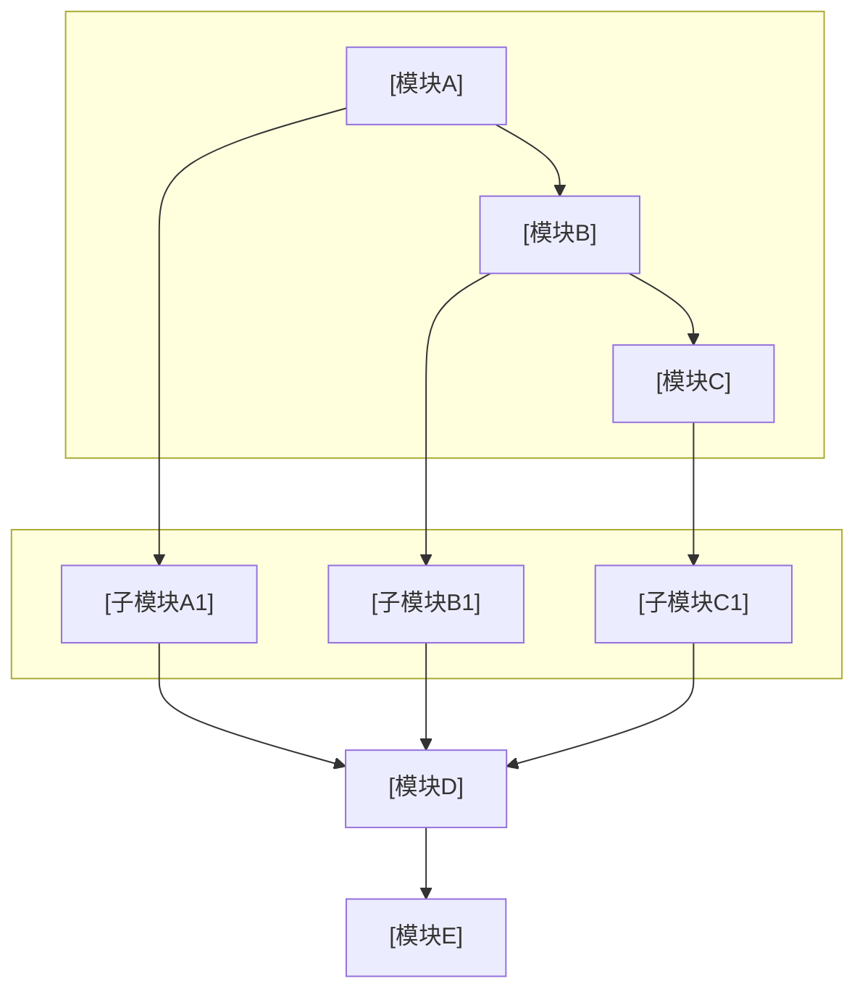

# 交底书分阶段工作流提示词（modex-3 同源吸收，2026-09-22）

> 本文由上游 `patent-draft/prompts/` 11 个分册合并中性化而来：上游专有脚本调用
> （`docx_to_md.py` / `pptx_to_md.py` / `cnipa_epub_search.py` / `iteration_dialog_log.py`）
> 已改写为可选软依赖并给出本仓兜底路径（`tools/doc_reader.py`、WebSearch、手工 JSONL/记录追加）。
> 本仓主流程见 `../SKILL.md`（内联要点为准）；本文提供其未覆盖的**扫描/查新/自检/合并/纠正迭代**深潜规程。


---

## 分册 `intake.md`（上游原名；文中引用按本文件同名小节解析）

## 边界与输入录入（Step 1）

### 用途

在开始专利挖掘与交底书撰写前，用**少量问题**收敛案件边界。信息不全时可跳过，由 Agent 后续推断并**注明假设**。

### 可选开场

```
为便于挖掘专利点与组织交底书，先确认几项边界；可跳过，将按已有材料推断。
```

### 问题序列

#### Q1：技术主题或产品模块

```
请用一句话描述本方案所属技术主题或产品模块，例如「多模态检索排序」「工业质检缺陷分级」。
```

#### Q2：专利类型倾向

```
是否已有倾向的权利要求类型？方法 / 系统 / 装置 / 暂不确定
```

#### Q3：文头联系人

```
交底书文头的技术联系人是否需要占位？需要则提供姓名/电话/邮箱；不需要则全部写「待填写」。
```

### 汇总

将已确认项用 3–6 行 bullet 复述给用户，再进入 `project_scan.md` 对应的扫描阶段。

---

## 分册 `project_scan.md`（上游原名；文中引用按本文件同名小节解析）

## 项目文档扫描（Step 2）

### 目标

按优先级扫描并提取**可专利化**内容。**根据当前项目结构调整扫描路径**。

### 优先级表

| 优先级 | 文档类型 | 关注内容 |
|--------|----------|----------|
| 1 | 专利相关文档 | 专利点分析、已有交底书、专利申报建议、创新点汇总 |
| 2 | 详细设计/方案文档 | 详细设计、方案讨论、流程图、完整流程、技术对比分析 |
| 3 | 核心实现代码 | 算法与策略实现、业务逻辑与流程编排、数据处理与转换、规则引擎与决策逻辑、接口与集成设计、状态机与调度机制、性能优化与缓存策略、安全与权限控制等（依项目领域灵活识别） |
| 4 | 系统设计文档 | 系统设计、架构说明、模块划分、数据流与控制流 |

### 扫描目标目录模版

执行时按项目实际目录填写：

```
[项目根目录]/
├── [专利或文档目录]/     ← 专利点分析、交底书、申报建议
├── [设计文档目录]/       ← 详细设计、方案讨论、流程图、技术对比
├── [代码目录]/           ← 算法实现、业务逻辑、规则引擎、接口与集成、调度机制等
└── [根目录]/             ← 系统设计、架构说明、模块与数据流
```

### 执行提示

- 大仓库先用搜索 / 语义检索定位关键文件，再精读。
- 记录**引用路径或文件名**，便于在交底书中写「参见某设计」时脱敏表述。
- 凡出现 **`.docx` / `.pptx`**，**必须**按下一节 **「Office 文档」** 先转 Markdown 再读，不可跳过或只扫纯文本而漏掉 Office。

### Office 文档（.docx / .pptx）：必先转换再读

**格式**：脚本仅支持 OOXML（**`.docx` / `.pptx`**）。旧版 **`.doc` / `.ppt`** 须先在 Office / WPS 中**另存为**新格式后再走下列流程。

Agent **不得**因「只能舒适读取文本」而**遗漏**项目内的 Word / PPT：**必须先转为 Markdown 再纳入扫描**，不能只扫 `.md` 与源码。

1. **发现**：在扫描目录内 **`Glob` 或列举** `*.docx`、`*.pptx`（含子目录，如 `docs/sample_*.docx`）。
2. **转换**：本仓统一用 `python tools/doc_reader.py "<路径>/<名>.docx" --out "<同目录或 docs>/<名>.md"`（pptx 同理）。若工作区另有 docx_to_md/pptx_to_md 脚本（可选软依赖）也可使用；两者都没有时，用 Office/WPS 另存文本或 `Read` 可读形式纳入扫描，不得跳过 Word/PPT。

   需已 `pip install -r requirements.txt`。输出旁会生成 **`{md 主名}_media/`**，内为嵌入图，**以生成的 `.md` 正文与图片引用为扫描依据**。
3. **再读**：**`Read`** 上述新生成的 `.md`（及必要时扫一眼 `_media` 文件名用于脱敏引用），与原有 `.md`、代码**同等对待**，摘要进专利点材料表。
4. **解析重点**：表格、编号列表、**PPT 每页标题与正文**、**Word 修订区以外的正文**、**备注**（`pptx_to_md` 会写入「备注」小节）——均属可专利化叙述来源。

### 图片与裸图目录（跳过单独识图）

- **`sample_assets/`** 等目录下的 **独立 `.png` / `.jpg` / `.webp` 等**：**不作为** Step 2 必须逐个打开、OCR 或描述的对象（与 Word/PPT 内嵌图**通常重复**时更不必重复读图）。
- **例外**：用户**点名**某图片路径，或某图**未**出现在任何已转换 Office 的 `_media` 中且对专利点明显关键时，再按需处理。
- Word/PPT 转换后，嵌入图已在 **``** 中体现，**以 Markdown 文本扫描为主**即可。

### 示例案件 `knowledge/docs/`（练习时勿漏）

若扫描路径包含 **`examples/example_batch_job_scheduler/knowledge/`**（或同构案件目录），须覆盖：

| 路径 | 动作 |
|------|------|
| `docs/architecture.md` | 直接 Read |
| `docs/sample_architecture_review.docx` | **先** `tools/doc_reader.py` 转 Markdown → 再 Read 生成的 `.md` |
| `docs/sample_scheduler_deck.pptx` | **先** `tools/doc_reader.py` 转 Markdown → 再 Read 生成的 `.md` |
| `docs/sample_assets/*.png` | **跳过**单独精读（内容已由 Office 内嵌图 + 转换 MD 覆盖） |
| `pkg/scheduler/*.go` | Read |

---

## 分册 `patent_points_analyzer.md`（上游原名；文中引用按本文件同名小节解析）

## 专利点挖掘与融合（Step 3–4）

### Step 3：候选专利点

- 列出 **3–5 个**候选专利点。
- 每个专利点需说明：
  - 技术背景
  - 创新点
  - 与现有技术区别（可先基于材料推断，查新后在第一章收紧）
  - 可实施性
- 可基于已有事实**适度推演**，但须有技术合理性支撑。

### Step 4：融合与选定

- 检查多个专利点是否可合并创新要素。
- 将相关技术点融合为**方法+系统**类专利（如适用）。
- 突出「组合创新」：若干要素有机结合形成的独创性方案。

#### 输出策略

**默认**：最终优先产出**最有价值的一篇**交底书。

若用户明确要求多篇：先列多篇大纲（标题 + 核心区别），再与用户约定撰写顺序。

#### 选定依据

- 创新性、可授权性
- 与查新结果的差异化（查新完成后复核）
- 技术方案完整、可实施
- 保护范围合理

---

## 分册 `prior_art_search.md`（上游原名；文中引用按本文件同名小节解析）

## 联网检索查新（Step 5）

### 必做时机

生成交底书全文**之前或生成过程中**必须执行；检索结论写入第一章 **1.1 现有技术** 及与本案的**区别论述**。

### 检索渠道（**优先国知局公布公告站，再降级 WebSearch**）

#### A. 中国专利公布公告（**优先**，官方站点）

1. **站点**：[国家知识产权局 中国专利公布公告](http://epub.cnipa.gov.cn/)（**仅** `epub.cnipa.gov.cn`）。
2. **工具**（本仓库 `tools/`）：**`cnipa_epub_search.py`** —— **一步**完成公布站检索与结果解析（Playwright 过站点 WAF）；结果页 HTML **仅在内存中处理，不落盘**。成功时终端含 **`EPUB_NOTE:`**（ASCII，如 `html_bytes=… disk=0`）与 **`EPUB_HITS_JSON:`** 一行（JSON 数组：标题、公开号、链接、**`abstract`** 等）。
3. **国知局检索词（生成阶段必做，须在拼 Bash 之前完成）**

   - **拆分责任在 Agent**：在**生成/构造命令阶段**，从本案技术方案、专利点或用户主题中归纳 **2～8 个与方案相关度高的检索单位**，**仅用 ASCII 空格分隔**，再写入 `cnipa_epub_search.py` 的参数。每一单位宜为 **有检索意义的语义块**，例如：**专业术语**、**名词短语**、**名动组合（如「批量调度」「异构调度」）**、**业内固定搭配**；**不要**拆成过碎的单字、泛义双字（如单独 `检索`、`增强`、`系统`、`方法` 等泛词），也**不要**把无关联词硬凑成一串。
   - **禁止**把**无空格的一整句长中文**当作**唯一**参数（例如不要：`".../cnipa_epub_search.py" "知识库检索增强大语言模型"`）。长串在公布站单框内易被当作整句 AND，**极易 0 条**。
   - **Agent 执行时**：**每一轮 `Bash` 只传一个**检索单位（一个词块一句参数）；**2～8 个单位须对应 2～8 次**独立调用，**禁止**在一次工具调用里把多个词块同时作为多个 argv 传给 `cnipa_epub_search.py`（脚本虽支持多词单次进程内合并，**仅供本地/人工**；Agent 为控时、降单次 Playwright 链路与 IDE/终端超时风险，**必须**拆进程）。
   - 示意（须按本案替换；**三次调用、每次一词**）：

     ```bash
     （可选软依赖脚本，缺省走 WebSearch）cnipa 检索：知识库
     （可选软依赖脚本，缺省走 WebSearch）cnipa 检索：检索增强
     （可选软依赖脚本，缺省走 WebSearch）cnipa 检索：大语言模型
     ```

   - **脚本不做**自动分词或自动拆长中文；若确需**整句一次** AND 检索，改用 **`cnipa_epub_crawler.py`** 单传一句。

4. **执行方式**（Step 5 在读完本文件后**先尝试**）：

   本仓默认路径：对上一节每个检索单位各执行一次 WebSearch/网页抓取，检索国知局公布公告站（epub.cnipa.gov.cn）及公开专利库；若工作区提供 cnipa 爬虫脚本（可选软依赖，需 playwright）则按其输出契约调用并解析其 JSON 命中行。

   - **合并责任在 Agent**：每次调用解析 **stdout** 上**唯一一行** **`EPUB_HITS_JSON:`** 后的 JSON 数组；在推理中按 **`pub_number`** 为主键去重合并（无则 **`link`**，再否则可用标题前缀），得到**一份**总表后再写入查新笔记与 1.1。
   - **`cnipa_epub_search.py`** 若人工单次传入多词，会按空白拆段、进程内**一段一查**并去重（**stderr** 可出现 **`EPUB_MERGE:`**）；与 Agent **分多次调用**策略无关。
   - 成功时 **stdout 仅一行** **`EPUB_HITS_JSON:`** + JSON 数组（UTF-8，含中文 `abstract`）；**`EPUB_MERGE:`** / **`EPUB_NOTE:`** / **`EPUB_HINT:`** 等在 **stderr** 且为 **ASCII**（减轻 PowerShell 把中文 stderr 当成错误流）。解析命中时请以 **stdout 该行 JSON 为准**，勿因 stderr 或终端编码误判「未命中」而不必要地降级 WebSearch。Windows 乱码与 PowerShell 注意见 **`INSTALL.md`**（`chcp 65001` / `PYTHONUTF8=1`、勿滥用 `2>&1`）。
   - 将 JSON 中**可核验**的公开号、标题、**国知局站点内详情链接**写入查新笔记与 1.1（见下 **`abstract` 必用**）。
   - **降级条件**（满足任一则进入 **B**）：命令非 0 退出、超时、无 Playwright、**`EPUB_HITS_JSON` 为空数组**、或条目经人工核对明显与主题无关。

5. **`abstract` 字段（国知局条目，规定必用）**

   若 **`EPUB_HITS_JSON`** 中某项含非空的 **`abstract`**（解析自公布站结果页摘要），对**该条专利**须同时遵守：

   - **必用**：查新笔记、交底书 **1.1** 中对该专利的**技术方案概括、应用场景与局限性分析**，**必须先基于对该 `abstract` 的完整阅读与理解**后再撰写；**禁止**仅凭标题、公开号或 URL **臆造**方案要点或与摘要矛盾的表述。
   - **充分理解**：在写入 1.1 或查新笔记前，Agent 须在**推理过程内**明确：摘要所涉**技术领域、解决什么问题、核心手段/模块、主要效果或流程**；若摘要与标题存在差异，**以摘要为准**概括该技术。
   - **正文呈现**：交底书 1.1 中**不得**大段逐字粘贴官方摘要（避免抄袭与超字数）；应**消化后**用**自己的话**压缩为「方案概括 + 应用 + 缺点/局限」；查新笔记可保留稍长的摘录供自用核对，但须标注来源于公布站摘要。
   - **缺失时**：若某条 JSON **无** `abstract` 或为空（旧版页面 / 表格布局未解析到等），须在查新笔记中注明「该条无摘要字段」，并改用**详情页**或 **Google Patents** 等可核验来源补全理解后再写 1.1，**不得**留空理由含糊带过。

6. **链接与著录**：国知局详情 URL 以脚本输出为准；**禁止编造**；若仅能从公布站得到公开号，可再配 **Google Patents** 稳定页 `https://patents.google.com/patent/CN…/en` 作为**补充**公开源（仍须打开校验）。

#### B. Google 学术与 Google Patents（**降级 / 补充**）

在 **A 不可用或结果不足**时启用，与历史约定一致：

1. **中文文献与学术**：[Google 学术搜索](https://scholar.google.com)（`scholar.google.com`）。
   - 用**中文关键词**、技术方案核心术语、应用场景；可组合 2–3 组查询。
   - 强化「中国」语境时可加：`中国`、`site:.cn`、`专利`、`CN`（与专利号区分使用）等，以实际命中为准。
   - 通过 **WebSearch** 或浏览器可用能力检索 Scholar；结果中优先选用**可打开、与标题/作者匹配**的条目链接。
2. **中国专利公开文献（补充）**：[Google Patents](https://patents.google.com/) 检索中文标题、申请人或公开号（`CN…A` / `CN…B` 等），每条使用**稳定著录页 URL**。
3. **其它来源**：英文文献、非中国专利等可继续用 Google Patents、出版社页面、DOI、arXiv 等 + WebSearch。
4. **关键词构造**：技术方案核心术语、应用场景与方法名称，可组合 2–3 组查询。

### 分析要求

对检索到的、与方案**高度相关**的现有专利或公开文献逐项概括：

- 专利号 / 文献标识
- 技术方案要点（**若为国知局 JSON 且含 `abstract`，要点须与摘要理解一致**，见上文「`abstract` 必用」）
- 应用场景
- **局限性**
- **公开源 URL（必填）**：每一条必须附带**至少一个可公开访问、与著录项一致**的链接，写入查新笔记与交底书 1.1，便于代理人复核。**禁止编造或猜测 URL**；写入前应在浏览器中打开确认页面可访问且对应同一文献/专利。

#### 链接来源与格式（须准确）

| 类型 | 推荐 URL 形式 | 说明 |
|------|----------------|------|
| 美国等专利（公开出版物号） | `https://patents.google.com/patent/US20240118920A1/en` | 将 `US20240118920A1` 替换为实际公开号；以 Google Patents 页面能打开且标题/摘要匹配为准。 |
| 中国专利 | **`https://patents.google.com/patent/CNXXXXXXXXXA/en`**（或对应 B 型等） | **优先**国知局公布站或 Google Patents 稳定著录页；勿依赖易过期的检索会话 URL。 |
| 学术论文（含 Scholar） | Scholar 条目页、出版社官方页或 **`https://doi.org/10.xxxx/...`** | Scholar 链接若重定向或镜像，以最终可长期解析的 DOI/出版社页为准。 |
| arXiv 预印本 | `https://arxiv.org/abs/2008.09213` | `abs` 页为规范条目页；勿用未经验证的镜像域名冒充官方。 |
| 期刊 / 会议 | 出版社 DOI：`https://doi.org/10.xxxx/...` 或官方摘要页 | 以 DOI 解析后页面与文献一致为准。 |

文末给出：**检索总结**与**本发明与现有技术的本质区别**，与 1.1 结尾及 1.2 缺点呼应。

### 记录习惯

便于写进交底书：保留专利号、标题、**消化摘要后的**一两句方案概括（有 **`abstract`** 时概括须可追溯至该摘要）；**每条另起一行或表格列给出「来源 URL」**。避免大段抄袭权利要求或整段粘贴官方摘要。

#### 1.1「检索说明」写法（交付正文，必遵）

写入交底书 **1.1** 开头的「检索说明」时，面向**代理人/审查员**表述，**不要**暴露 Agent 查新流程或本仓库工具实现。

- **须写**：实际使用的**公开数据库或渠道名称**（如「国家知识产权局专利公布公告系统」）、本案**主要检索词**（与 Step 5 用词一致或概括）；若部分条目经 **Google Patents** 等公开页复核著录项，可一句带过。
- **禁止写入 1.1 正文**：脚本/文件名（如 **`cnipa_epub_search.py`**、**`cnipa_epub_crawler.py`**）、「查新优先使用…检索工具」「是否触发 Google 学术降级」、Playwright、WebSearch、Agent、技能仓库名等**内部或流程元信息**。
- **示例（须按本案替换检索词与渠道）**：

  > 检索说明：在**国家知识产权局专利公布公告系统**及 **Google Patents** 中，以「批任务调度」「异构集群调度」「任务队列重排」「负载感知调度」等为检索词进行检索；部分条目的公开文本与著录项以 Google Patents 页面复核。

查新笔记（Agent 内部或对话留档）仍可记录是否调用脚本、是否降级 WebSearch；**上述内容不得原样抄进交底书 1.1**。

---

## 分册 `disclosure_builder.md`（上游原名；文中引用按本文件同名小节解析）

## 技术交底书生成模板（Step 7）

详细章节范例与 **mermaid** 图示模版见同目录 **`template_reference.md`**。

### 7.1 章节结构

```
1. 注意事项
2. 一、介绍相关技术背景，描述与本发明技术最相近的现有技术，并说明该现有技术存在的缺点
   - 1.1 现有技术（按技术方向分类，含专利检索结果）
   - 1.2 现有技术存在的缺点
3. 二、针对上述缺点，说明本发明所要解决的技术问题
4. 三、本发明技术方案的详细阐述
   - 3.1 背景
   - 3.2 系统框图（**mermaid**，如 `flowchart` + `subgraph` 分层；交付前经工具转 PNG；**不要** ASCII 文字框图）
   - 3.3 模块功能说明（聚焦作用与关联关系，非输入输出）
   - 3.4 系统流程说明（**mermaid 流程图**，交付前经工具转 PNG；**不要** ASCII 文字/箭头流程图）
   - 3.4.1 符号与公式（出现公式或形式化变量时**须设**；**须**先符号与变量定义、再写公式；体例见 **§7.7** 与 **`template_reference.md` §3.4.1**）
   - 3.5 关键技术参数（参数表「符号」列与 3.4.1 **同形**）
5. 四、与现有技术相比，本发明具有哪些优点？
6. 五、本发明的技术关键点和欲保护点是什么？
7. 六、其它（实施例、技术效果、参数示例）
```

**第一章 1.1 撰写硬性要求**：在「按技术方向分类」的**每一条**现有技术（专利或文献）末尾或表格中，必须给出 **经核验的公开源 URL**（规范与示例见 `prior_art_search.md` 与 `template_reference.md` §1.1）。**国知局检索**（`EPUB_HITS_JSON`）中对该专利给出的 **`abstract` 非空时**：文中「技术方案 / 应用 / 局限」类表述**须以摘要理解为前提**（消化后重写，非整段粘贴），**禁止**与摘要明显矛盾或脱离摘要杜撰；详见 **`prior_art_search.md`**「`abstract` 必用」。

**禁止输出**：交底书正文中**不得**包含「自检清单」章节，例如检查项表格或带状态符号的清单列。自检见 `disclosure_self_check.md`，**内部执行**，不写入交付正文。

**禁止仓库/技能脚注**：交付用 Markdown **末尾不得**出现任何指向本技能或示例仓库的说明，例如「本文件为 `patent-disclosure-skill` 仓库内教学示例」「不构成任何法律或技术承诺」「虚构教学」「详见 `examples/`」等。正文**止于第六章及此前章节**；**不要**在文末追加斜体免责或仓库署名。

### 7.2 文档头部模板

```markdown
## 技术交底书

**案件名称**：[待填写]一种XXX方法及系统

**技术联系人**：
- 姓名：[待填写]
- 电话：[待填写]
- 邮箱：[待填写]

**专利类型**：发明

---

### 注意事项

（1）交底书应使代理人能看懂，尤其是背景技术和详细技术方案，一定要写得全面、清楚、完整；
（2）技术的公开程度，应以本领域普通技术人员不需付出创造性劳动即可进行实施为准。
（3）在与代理人沟通时，对于代理人咨询的技术问题，应给予回答并认真讲解，并且按要求及时正确地补充相应技术材料。
```

### 7.3 输出文件命名（用户产出目录，必遵循）

在用户目录（如 `outputs/{案件标识}/`）写入交底书 **Markdown / Word** 时，**主文件名须体现正文中的「案件名称」**，且**凡向用户落盘交付的定稿均须带时间戳后缀**（见下第 5 点），避免无区分度的固定名（如一律 `disclosure_draft.md`）。**仓库内 `examples/` 为教学统一可仍用固定名**；用户产出不适用该惯例。

1. **提取**：从 `**案件名称**：` 行取完整发明名称；去掉占位（如 `[待填写]`、`【待填写】`）、首尾空格。
2. **规范化**：删除或替换 Windows 非法字符 `\ / : * ? " < > |` 与换行；连续空格可压为单个空格或删去（中文标题通常无空格亦可）。
3. **长度**：文件名（不含扩展名）建议 **≤ 80 个字符**；超长则**截断**到约 80 字并保留语义完整（例如截在「方法及系统」等结尾词之前），勿用无意义随机串。
4. **定稿命令**：`mermaid_render.py` 的 `-o` / `--docx` 须使用**同一主文件名**，且该主名**必须符合第 5 点**（**案件名 + `_` + 14 位时间戳**）。示例（案件名已按上文规范化、过长已截断时）：

   `python tools/mermaid_render.py -i "…草稿.md" -o "一种异构计算环境下基于资源画像与限频重排队的批任务调度方法及系统_20260408143025.md"`

   默认同目录生成同名 `.docx`。过程性中间稿（仅自用、非交付）文件名可自定，但**最终交付**不得省略时间戳。

5. **时间戳后缀（凡落盘交付必遵循）**：凡写入用户产出目录、作为**向用户交付**的技术交底书 **`.md` / `.docx`**，主文件名须为：  
   **`{§7.3 规范化案件名}_{YYYYMMDDHHmmss}.md`** 与同名 **`.docx`**。  
   - **首次定稿**与**迭代合并/纠正**适用**同一规则**；每次交付取**当次落盘时**的**本地时间** 14 位数字（年月日时分秒各 2 位，如 `20260408143025`）。  
   - **不要覆盖**已有交付文件；新一次交付即**新时间戳**、新文件名。用户**明确要求**覆盖某路径时从其意。  
   - **`mermaid_render.py`** 的 `-o` 与可选 `--docx` 须与上述主名一致。  
   - **例外**：（1）仓库内 **`examples/`** 示例可继续固定文件名；（2）用户书面指定文件名时从其意（仍建议保留时间戳以免混淆）。

Agent **落盘时**即采用上述命名，并在回复中写明路径，便于用户对照标题与磁盘文件。

### 7.4 系统框图与流程图要点

- **系统框图与流程图**均仅用 **fenced mermaid**（本地 `mmdc` 渲染，不依赖外网 PlantUML）；Word 中以 PNG 为准，**无需**再附 ASCII 文字框图
- mermaid 内节点标签用简短中文/数字，避免 ①②③。可另写简短「流程说明」段落概括各步，**不得**用 ASCII 框线箭头代替图示

### 7.5 脱敏要求

| 类型 | 脱敏方式 | 示例 |
|------|----------|------|
| 业务/行业 | 抽象为通用描述 | 「XX检测」→「多标签分类场景」 |
| 具体分类 | 用 ABC 等替代 | 「类别1、类别2」→「分类A、分类B、分类C」 |
| 具体数值 | 用范围或示例说明 | 「每日 N 人」→「每日一定规模」 |
| 公司/产品 | 不出现具体名称 | 删除或替换为「某系统」 |

### 7.7 符号与公式体例（必遵）

> **⚠️ 本节是给你（撰写者）的规范，仅供遵循，严禁把规范条款文字（如"行内公式全文统一 `\(...\)` 或 `$...$` 二选一，不得混用""禁止用 `^{cpu}` 上标表示维度"等）逐字抄写进交底书正文。** 交底书正文只应出现**符合本规范的成品内容**（符号表、公式、说明），绝不出现规范说明、"必遵""禁止""二选一"这类元指令文字。

撰写 **3.4.1**、**3.5** 及全文含 LaTeX 的段落时须遵循；正/反例与符号表示例见 **`template_reference.md` §3.4.1**。

#### 符号表先行

- 撰写 **3.4.1** 或全文含 LaTeX 时，**先写符号与变量定义**（可按（1）任务/对象下标、（2）节点/环境下标、（3）标量与向量分组），每项至少含：**符号、含义、下标含义（如 \(i\)=任务、\(j\)=节点）、量纲或取值范围**。
- 其后公式、**3.5 参数表**、**第六章实施例**中出现的符号须与符号表 **同形、同义**。
- **禁止同一字母多义**：例如任务侧权重用 \(b\)，节点侧饱和度应改用 \(g\)、\(h\) 等其它字母，勿任务/节点共用 \(b\) 表示不同物理量。

#### 下标与上标

- **资源维度/类型标签**（cpu、mem、io、peak 等）一律写入 **下标**，维度名用 `\mathrm{cpu}`、`\mathrm{mem}` 等正体，例如 `b_{i,\mathrm{cpu}}`、`a_{j,\mathrm{mem}}`。
- **禁止**用 `^{cpu}`、`^{mem}`、`^{io}` 等 **上标** 表示维度或字段名（易被读作幂次，亦不符合专利正文常见写法）。
- **上标仅用于**：幂次、转置、序号、撇号类标记；**下标用于**对象编号与维度标签。

#### LaTeX 分隔与写法（全文统一）

- **行内公式**：全文统一 **`\(...\)`** 或 **`$...$`** 二选一，**不得混用**。
- **块级公式**：全文统一 **`\[...\]`** 或 **`$$...$$`** 二选一，**不得混用**。
- 比较符优先写 `\leq`、`\geq`（定稿工具可兼容 `\le`/`\ge`，正文仍推荐 `\leq`/`\geq`）。
- 块级公式尽量 **单行写完**；需编号时用 `\tag{1}` 或正文写「式 (1)」，**全文择一**并保持体例一致。
- 逻辑连接词（「且」「或」）优先写在公式 **外** 的中文叙述中；若必须写入公式内，用 `\land`/`\lor`，**避免** `\text{且}` 等复杂文本命令（定稿渲染易失败）。

#### 跨节一致

- **3.4.1 符号表**、正文首次定义式、**3.5「符号」列**、**第六章实施例** 四处须 **逐字同形**。
- 修改任一处符号时，须同步核对上述各处及 3.3/3.4 文字叙述中的同名变量。

---

### 定稿交付：Markdown + Word（必做）

**版本与覆盖**：凡交付均以 **§7.3 第 5 点**「**案件名 + 时间戳**」落盘，同目录下多文件即版本历史。**可选**：另存 `versions/` 手工快照非强制。

须**同时**交付：

1. **Markdown**：定稿 `.md` **保留** `` ```mermaid`` 围栏源码，并含 ``<!--  -->`` 注释引用（由 `mermaid_render.py` 生成）。
2. **Word**：对上一文件执行 `md_to_docx.py`，或使用一条命令：

`python tools/mermaid_render.py -i <含图示的草稿.md> -o "<案件名_YYYYMMDDHHmmss>.md"`（默认在同目录生成**同名** `.docx`；可用 `--docx` 指定路径，`--no-docx` 跳过 Word。Word 失败时见终端提示的手动命令。）

（mermaid 依赖 Node/mmdc、`pip install -r requirements.txt` 见 `tools/README.md`。）

### 7.6 交付回复：权利要求偏向点（建议交互，必做）

每次向用户**交付**本技能产出的定稿（已写明 **`{案件名}_{YYYYMMDDHHmmss}.md` / `.docx` 路径**）时，在**同一条对话回复**中**追加**一段**仅供用户选用**的交互引导（**不得**写入交底书正文、不得出现在 `.md`/`.docx` 内）。

**须交代清楚：**

1. 用户若希望对**第五章「技术关键点和欲保护点」**做更贴近**权利要求书撰写习惯**的强化，可**用一句话说明侧重点**。  
2. 承接方式：Agent **`Read`** **`iteration_context.md`**，再按 **`merger.md`** 以**当前交付稿为基准**合并，**另存**新时间戳 **`.md` / `.docx`**（§7.3 第 5 点），并维护 **`交底书修订对话记录.md`**。  
3. **禁止捏造偏向**：对话里提出的「可对举的两类侧重点」**必须**能从**当前定稿与上游已用材料**中推出——包括 Step 2 扫描文档、Step 3–4 已整理专利点、**第三至五章已写明的技术方案与保护点表述**；**不得**为了凑交互而编造本案未涉及的场景、模块或行业词。若全文仅有一条清晰保护主线，**只须忠实概括该主线**并询问是否改为更「方法/系统/流程步骤」或更「装置/模块」等**书式侧重**（仍须对应文中已有结构，不新增技术事实）。  
4. 在满足上条前提下，可给出**两组可对举的偏向**（用语须**摘编或概括**自正文已有概念，而非套用泛例）；句式可参考：

> 若您希望权利要求/保护点表述更偏「……」或更偏「……」（**二者均须与本稿已阐述的技术路线或保护点一致，仅为书式或强调重心之择**），请说明侧重点；我可按 **`iteration_context.md`** 与 **`merger.md`** 另存一版，对**第五章做权利要求书式强化**（无新材料时其它章节以衔接一致为前提，尽量保持既有结论）。

**合并 / 纠正迭代**若再次交付定稿，**仍须**附带本节同类引导（可缩短为 1～2 句，但须保留「第五章」「新时间戳」「iteration_context + merger」三要素之一或等效说明，且**仍遵守「不捏造」**）。

---

## 分册 `disclosure_preview.md`（上游原名；文中引用按本文件同名小节解析）

## 交底书生成前摘要预览（Step 6）

### 目的

在输出完整长文前降低返工：先展示结构化摘要，请用户 **确认 / 调整方向**。

若用户明确要求跳过预览，可直接进入 `disclosure_builder.md` 生成全文。

### 摘要应包含

- 选定专利点名称（工作标题）
- 解决的技术问题：对应现有技术缺点，1–3 条
- 核心创新模块或步骤（3–6 条）
- 与检索到的**最相近**现有技术的区别（1 段）

### 可选确认语

```
以上方向是否确认？确认后将按模版输出完整技术交底书，含 mermaid 系统框图与流程图（定稿时将转为 PNG 并同时交付 .md 与 .docx）。
```

### 禁止写入

摘要 Markdown **末尾不得**追加技能仓库名、`examples/` 路径、「教学示例」「虚构」「不构成法律承诺」等脚注（与 `disclosure_builder.md` 对定稿的要求一致）。

---

## 分册 `disclosure_self_check.md`（上游原名；文中引用按本文件同名小节解析）

## 交底书生成后自检（Step 8，内部执行）

自检结果用于**修订正文**，默认**不单独输出自检报告**；用户索要时可单独提供。**不得**将自检清单作为交底书一章写入正文。

### 8.1 逻辑与闭环

- [ ] 技术方案是否形成完整闭环（发现→处理→扩展/输出）？
- [ ] 模块之间关联关系是否清晰？上下游是否衔接？
- [ ] 分支样本（如边界样本、低置信度样本等）是否有明确处理路径？
- [ ] 依赖项（如类别中心、动态阈值等）是否有来源说明？
- [ ] 第五章「技术关键点」与第三章「系统流程」是否呼应？第五章以论点概述为主，技术细节在第三章。

### 8.2 公式与参数一致性

**Step 8 必做（含公式时）**：除符号体例与跨节一致外，须**主动复核公式是否正确、公式逻辑是否与第三章叙述一致**（等同用户会提出的「检查公式和公式逻辑是否有误，有误请调整」）；发现问题**直接改稿**，勿仅提示用户自行修改。

#### 符号与体例

- [ ] **符号表（3.4.1）**：全文含公式时是否已设 **3.4.1** 并 **先定义符号**（含义、下标、量纲）；式 (1) 及后文每个符号是否均已在表中定义？
- [ ] **维度下标**：是否存在 `^{cpu}`、`^{mem}`、`^{io}` 等 **上标表示维度** 的写法？若有须改为 `b_{i,\mathrm{cpu}}`、`a_{j,\mathrm{mem}}` 等 **下标 + `\mathrm{}`** 形式（见 **`disclosure_builder.md` §7.7**）
- [ ] **字母多义**：同一字母是否兼指任务侧与节点侧等不同对象？若有须拆分符号（如任务用 \(b\)、节点用 \(g\)）
- [ ] **公式表述一致**：同一物理量在不同公式、段落中是否 **同形同义**（如权重公式、调整系数、匹配分 \(M_{ij}\) 等）
- [ ] **LaTeX 体例**：行内/块级分隔符是否全文统一（`\(...\)`/`\[...\]` 或 `$`/`$$` 二选一）；块级公式是否尽量单行；是否避免 `\text{且}` 等易渲染失败写法
- [ ] **3.5 与符号表**：3.5 参数表「符号」列是否与 3.4.1 **逐字同形**
- [ ] **阈值范围**：与正文一致（如 0.5–1.5、0.8–1.2 等）
- [ ] **参数命名**：全文统一，避免同义不同名混用
- [ ] **实施例数值**：与 3.5 关键技术参数对应，不冲突

#### 公式正确性与逻辑（必核）

- [ ] **式面正确性**：各式是否无明显笔误（运算符、括号配对、上下标错位、同一式内符号与符号表不符、缺项/多写项、指数或分母写错等）？
- [ ] **约束与不等式方向**：公式中的 `\leq`/`\geq`/正负号是否与文字含义一致（如「饱和度」「有余量」「限频间隔」等）；多条件「且/或」是否与 3.4 流程分支一致？
- [ ] **公式与流程互推**：3.4.1 主公式（含式 (1)）及衍生式，能否与 **3.4 流程说明**（各步骤 S1—Sn）、**3.3 模块职责** 逐步对应？叙述中的打分、重排、限频、窗口聚合等是否在公式中有体现，**无**「文字一套、公式另一套」？
- [ ] **边界与特殊情形**：空队列、单节点、分母为零、指标缺失、达到上下界等情形，公式或正文是否给出合理处理或说明（至少不与主公式矛盾）？
- [ ] **量纲与取值**：符号表声明的量纲/取值范围是否与公式用法一致（如权重为正、比例在 0—1、计数为非负整数等）？
- [ ] **修订联动**：若修正公式或逻辑，是否已同步改 **3.4 文字**、**3.5 参数**、**第六章实施例** 及 **3.4.1 符号表**（见 §7.7 跨节一致）？

### 8.3 格式与引用

- [ ] **迭代路径**：若本次走 `merger.md` / `correction_handler.md`，对话中是否已含 **`## 合并摘要（留档）`** 或 **`## 纠正摘要（留档）`**（按该 prompt 字数要求）
- [ ] **修订对话记录**：案件目录是否已追加 **`交底书修订对话记录.md`** 一条（含记录时间、用户说明摘要、本轮交付文件名、摘要摘录），见 **`iteration_context.md`**
- [ ] **交付文件名**：凡落盘交付的交底书是否均为 **`{案件名}_{YYYYMMDDHHmmss}.md`** 及同名 `.docx`（§7.3 第 5 点，**含首次定稿与迭代**），未无故覆盖旧稿
- [ ] **系统框图与流程图**：均为 fenced mermaid，定稿已用 `mermaid_render.py` 转 PNG，**无** ASCII 文字流程图/框图；`.md` 已交付，`.docx` 已生成或已按提示手动 `md_to_docx.py` 补全
- [ ] 章节引用：如「详见 3.4.1」须指向真实存在的章节
- [ ] **1.1 现有技术**：每个方向下列举的专利/文献是否均附有**可访问且与著录项一致**的公开 URL（非编造）；是否与 `prior_art_search.md` 要求及 1.1「检索说明」自洽；**检索说明**是否**未**出现 `cnipa_epub_search.py`、WebSearch/降级等内部流程用语
- [ ] **查新摘要（国知局）**：凡 **`EPUB_HITS_JSON`** 中带非空 **`abstract`** 的条目，1.1 对该条的方案概括与局限**是否体现对摘要的理解**（非仅标题、且不与摘要矛盾）；无 `abstract` 的条目是否在查新路径上已按 `prior_art_search.md` 用其它可核验来源补全理解
- [ ] **文末清洁**：正文**无**技能仓库名、`examples/`、`disclosure_draft` 路径、「教学示例」「虚构」「不构成法律承诺」等**元信息脚注**（若存在则删除）
- [ ] **权利要求偏向点（对话）**：凡**定稿交付**的对话回复，是否已按 **`disclosure_builder.md` §7.6** 补充「可选下一步」类建议交互（**仅对话**，不入正文）；其中对举的侧重点是否**源于本稿与已定观点**，**无**凭空捏造

### 处理原则

发现问题则**直接修订正文**后再交付。  
**公式类**：Step 8 须完成 §8.2「公式正确性与逻辑」核对；有误则改公式并联动修订相关章节，**不要**只向用户报告问题而不改稿（除非缺少必要技术事实、无法从正文与材料推断正确写法）。

---

## 分册 `merger.md`（上游原名；文中引用按本文件同名小节解析）

## 迭代模式：增量合并（修订与补充）

### 执行门禁（优先执行，不可跳过）

1. **`Read`** **`prompts/iteration_context.md`**（迭代时读用户意图 + 已有稿路径，**不要**跳过合并去跑专利点分析）。
2. **`Read`** 用户给出的**当前定稿** `.md`（及本轮 @ 的补充材料）。
3. **落盘**：合并结果须写入**新文件**，文件名为 **`{案件名}_{YYYYMMDDHHmmss}.md`**，并经 `mermaid_render.py`（或等价流程）生成**同名** `.docx`，规则见 **`disclosure_builder.md` §7.3 第 5 点**。**禁止覆盖**上一轮交付文件（除非用户明确要求覆盖）。

**禁止**：在已判定为「在已有稿上迭代」时，去跑 Step 3–4 专利点全文分析、或仅泛泛「更新专利分析」而**未**把合并结果写入用户案件目录下的**新带时间戳文件**。**除非**用户明确要求重新挖掘/重写专利点。

### 何时启用

由 Agent 根据用户**意图**判断：**在已有交底书或上一轮输出上补充新材料**（新文档、新代码说明、粘贴片段、扩展章节等），且以**合并进现有结构**为主时，**应**执行本流程；用户按 **`disclosure_builder.md` §7.6** 仅要求**第五章权利要求书式强化**、已说明侧重点者，同样走本流程（合并范围以第五章为主）。**不要求**用户说出「迭代」等固定词；也**不必**先询问是否进入迭代模式。

### 流程

1. **识别增量**：新内容主要影响哪些章节：背景、1.1 现有技术、3.4 流程、实施例等。
2. **非破坏性合并**：以**追加或局部重写**为主，不推翻未涉及且用户未要求修改的章节。
3. **查新联动**：若增量改变了技术实质，判断是否需要**补充检索**并更新 1.1 / 区别论述。
4. **一致性**：合并后执行 `disclosure_self_check.md` 中的 **8.2、8.3** 快速检查；若涉及 **3.4.1 公式/3.5 参数**，须同步核对 **`disclosure_builder.md` §7.7**（符号表、维度下标、3.5 符号列同形）。
5. **落盘**：将合并后的全文写入 **`{案件名}_{YYYYMMDDHHmmss}.md`**，再经 `mermaid_render.py` 生成同名 `.docx`（§7.3 第 5 点）。
6. **对话记录**：按 **`iteration_context.md`**「修订对话记录」在案件目录追加 **`交底书修订对话记录.md`**（优先 **`tools/iteration_dialog_log.py --kind merge`**）。

### 输出（强制，不可省略）

在交付修改后的正文（或说明已写入路径）之后，**必须在同一条回复中**追加独立小节，**标题固定为**：

### 合并摘要（留档）

其下用 **3–6 句完整中文**，依次说明：**改了哪些章节**、**原因**、**是否影响保护点或检索结论**、**是否已做 8.2/8.3 核对**。  
若未输出本节，视为未完成本 prompt。

**定稿延续**：若本轮合并结果作为**向用户交付的定稿**，在**同一条回复**中于上文之后，**还须**按 **`disclosure_builder.md` §7.6** 补充「权利要求偏向点」建议交互（可缩写），**不得**写入交底书正文；交互中的对举选项**须**来自本稿已有论述，**禁止捏造**（见 §7.6 第 3 点）。

### 与「纠正」的区别

- **merger**：侧重新材料、新功能的**扩展**。
- **correction_handler**：侧重用户指出**错误、风格或与事实不符**的修正。

---

## 分册 `correction_handler.md`（上游原名；文中引用按本文件同名小节解析）

## 迭代模式：对话纠正

### 执行门禁

与 `merger.md` 相同：先 **`Read`** **`prompts/iteration_context.md`**，再 **Read** 当前定稿与纠正意图；纠正结果须**另存为** **`{案件名}_{YYYYMMDDHHmmss}.md`** 及同名 `.docx`（§7.3 第 5 点），**禁止**默认覆盖旧稿。**禁止**在迭代意图下无合并/纠正落盘却回到 Step 3–4 全文专利点分析（除非用户明确要求重做专利点）。

### 何时启用

由 Agent 根据用户**意图**判断：用户针对**已有交底书**指出**错误、与事实或参数不符、表述问题、保护点调整**等（例如「这里不对」「和 3.5 不一致」「保护点应强调 XXX」）时，**应**执行本流程。**不要求**用户说出「迭代」等固定词；也**不必**先询问是否进入迭代模式。

### 步骤

1. **提取纠正点**：具体章节、原问题、用户期望，可摘要用户原话。
2. **分类**：
   - **事实与技术**：流程、参数、模块关系 → 改第三章及相关实施例、3.5。
   - **符号与公式体例**：上标维度（如 `^{cpu}`）、符号多义、LaTeX 分隔符混用、3.5 与 3.4.1 不同形 → 改 **3.4.1 符号表**、相关公式、**3.5 符号列**及第六章实施例；遵循 **`disclosure_builder.md` §7.7** 与 **`template_reference.md` §3.4.1** 正/反例。
   - **查新与区别**：现有技术或区别论述不准 → 改第一章，必要时再检索。
   - **保护点与表述**：第四章、第五章论点 → 与第三章对齐，避免矛盾。
3. **落地修改**：形成纠正后全文，**写入新文件** **`{案件名}_{YYYYMMDDHHmmss}.md`** 并经 `mermaid_render.py` 生成同名 `.docx`（§7.3 第 5 点）；**禁止**无必要大段重写无关章节；**勿默认覆盖**用户上一版文件名。
4. **自检**：执行 `disclosure_self_check.md` 的 **8.2、8.3**。
5. **对话记录**：按 **`iteration_context.md`**「修订对话记录」在案件目录追加 **`交底书修订对话记录.md`**（优先 **`tools/iteration_dialog_log.py --kind correct`**）。

### 输出（强制，不可省略）

在交付修改后的正文（或说明已写入路径）之后，**必须在同一条回复中**追加独立小节，**标题固定为**：

### 纠正摘要（留档）

其下用 **2–5 句完整中文**，说明：**修改位置**、**依据**、**是否影响保护点或检索**。  
若未输出本节，视为未完成本 prompt。

**定稿延续**：若本轮纠正结果作为**向用户交付的定稿**，在**同一条回复**中于上文之后，**还须**按 **`disclosure_builder.md` §7.6** 补充「权利要求偏向点」建议交互（可 1～2 句缩写版），**不得**写入 `.md`/`.docx` 正文；**禁止**编造与定稿不符的「偏向」选项（见 §7.6 第 3 点）。

---

## 分册 `iteration_context.md`（上游原名；文中引用按本文件同名小节解析）

## 迭代上下文（进入 merger / correction 前必读）

### 本文作用

约定**迭代时先干什么、产出什么**，避免 Agent 只读了合并/纠正模板却转去跑 **Step 3–4 专利点分析**或空泛「更新分析」而不落盘新稿。

---

### 何时读本文

用户明显在**已有交底书或上一轮交付稿**上继续工作时（补材料、改章节、纠错、调保护点表述等），在 **`Read` `merger.md` 或 `correction_handler.md` 之前**先读本文，再读对应迭代模板。

| 意图 | 下一步模板 |
|------|------------|
| 补充文档、扩展方案、合并新材料 | `merger.md` |
| 指出错误、与事实/参数不符、风格或保护点调整 | `correction_handler.md` |
| 用户已按 `disclosure_builder.md` §7.6 声明侧重点，仅需 **第五章权利要求书式强化**（取向须与本稿已有材料及第五、三章已写观点一致，**禁止**为交互而编造新场景） | `merger.md`（以最近定稿为基准，合并范围以第五章为主，必要时微调第四章与第五章衔接句） |

---

### 输入与输出

**输入**

- 对话中的本轮说明；用户 **@** 的文件或粘贴片段。
- **`Read`** 当前作为基准的交底书 `.md`（路径由用户给出或对话中已出现）。

**输出**

- 合并或纠正后的全文写入**新文件**，不得默认覆盖旧稿：  
  **`{规范化案件名}_{YYYYMMDDHHmmss}.md`** + **`mermaid_render.py` 生成的同名 `.docx`**。  
- 与 **Step 7 首次定稿**为**同一命名规则**（凡落盘交付均带时间戳），详见 **`disclosure_builder.md` §7.3 第 5 点**。  
- 旧版 `.md`/`.docx` 保留在同目录，便于对照（用户明确要求覆盖时再覆盖）。

版本历史依赖**同目录下多个带时间戳的文件**，不需要 `iterations/` 子目录或快照脚本。

#### 修订对话记录（单独 Markdown，必做）

每完成一轮 **合并**或**纠正**并在磁盘上写出新 `.md`/`.docx` 后，须在**案件产出目录**（与本轮交付文件同一目录，如 `outputs/{案件标识}/`）维护**一个固定文件**：

- **文件名**：`交底书修订对话记录.md`（默认；若环境对中文路径敏感，可用 `--log-name disclosure_revision_log.md` 调用脚本）。

**每条记录须含**：

1. **记录时间**：**本地时间**与 **UTC**（脚本自动生成；手工追加时两者都写）。  
2. **类型**：合并迭代 / 纠正迭代。  
3. **用户说明摘要**：本轮用户意图、要点（可含 @ 文件名称）。  
4. **本轮交付文件**：新时间戳 `.md`、`.docx` 文件名。  
5. **合并/纠正摘要摘录**：与当轮对话中「合并摘要（留档）」「纠正摘要（留档）」一致或为其缩写。

**推荐**：在写出交付文件并生成 Word 之后，执行 **`Bash`**：

```text
python tools/iteration_dialog_log.py --case-dir "{案件目录}" --kind merge --user "{用户说明摘要}" --summary "{摘要摘录}" --artifacts "{案件名_时间戳.md},{案件名_时间戳.docx}"   # 可选软依赖：本仓默认按下方手工追加路径执行
```

`--kind` 纠正时用 `correct`。若无法执行脚本，须 **`Read`** 已有 `交底书修订对话记录.md`（若无则 **`Write`** 创建），再 **`StrReplace`** 或等价方式在文末**追加**与上表结构相同的一条（时间须真实）。

**禁止**：完成迭代交付却**完全不**更新该对话记录文件。

---

### 建议执行顺序（短清单）

1. 读本文 → 按上表选 `merger.md` 或 `correction_handler.md` 并 **`Read`**。
2. **`Read`** 基准稿 + 本轮补充材料。
3. 在稿内完成合并或纠正逻辑（自检 **8.2、8.3** 见 `disclosure_self_check.md`）。
4. **`Write`** 新时间戳 `.md` → 运行 **`mermaid_render.py -o`** 写出定稿图与 **`.docx`**。
5. 追加 **`交底书修订对话记录.md`**（**`iteration_dialog_log.py`** 或手工），见上文「修订对话记录」。
6. 在回复中写明新文件路径，并输出该模板要求的 **「合并摘要（留档）」**或 **「纠正摘要（留档）」**。

---

### 禁止

- 已判定为迭代意图时，**不**经合并/纠正流程、不把结果写入**新时间戳文件**，却去跑全文专利点挖掘或仅输出分析段落。
- 例外：用户**明确要求**「重新挖掘专利点 / 从头再走查新」时，可走主流程 Step 3 起。

---

## 分册 `template_reference.md`（上游原名；文中引用按本文件同名小节解析）

## 专利交底书模版参考（脱敏版）

本文档为技术交底书格式与章节要点参考，内容已脱敏，适用于多领域专利撰写。由 `disclosure_builder.md` 引用。

---

### 文档头部

```markdown
## 技术交底书

**案件名称**：[待填写]一种XXX方法及系统

**技术联系人**：
- 姓名：[待填写]
- 电话：[待填写]
- 邮箱：[待填写]

**专利类型**：发明

---

### 注意事项

（1）交底书应使代理人能看懂，尤其是背景技术和详细技术方案，一定要写得全面、清楚、完整；
（2）技术的公开程度，应以本领域普通技术人员不需付出创造性劳动即可进行实施为准。
（3）在与代理人沟通时，对于代理人咨询的技术问题，应给予回答并认真讲解，并且按要求及时正确地补充相应技术材料。
```

在用户产出目录保存时，**`.md` / `.docx` 主文件名**应为 **`{案件名称规范化}_{YYYYMMDDHHmmss}`**（占位去掉、非法字符、过长截断及时间戳规则见 `disclosure_builder.md` **§7.3**，**凡交付均须时间戳**），避免与标题无关的固定名。

---

### 一、技术背景与现有技术

#### 1.1 现有技术

- 检索渠道、链接格式与禁止事项以 Step 5 **`prior_art_search.md`** 为准（不在此重复）。
- **检索说明**（建议置于 1.1 开头）：写**公开数据库名称**与**检索词**；**勿**写 `cnipa_epub_search.py` 等脚本名或「查新降级」等流程用语（见 **`prior_art_search.md`「1.1 检索说明写法」**）
- 按**技术方向**分类列举（如：单标签方法、多标签方法、聚类策略等）
- 每条现有技术需包含：专利号 / 文献标识、申请方（或来源机构）、技术方案、应用场景、**局限性**、**公开源 URL（必填）**
  - **国知局 `abstract`**：若 Step 5 JSON 含 **`abstract`**，该条「技术方案」等叙述**必须先充分理解摘要后**再概括（见 **`prior_art_search.md`**）；交底书正文勿大段粘贴官方摘要全文。
  - **URL 要求**：与 `prior_art_search.md` 一致——每条**至少一个**可公开访问链接，**写入前验证**有效且与著录项一致；**禁止虚构链接**。
  - **正文呈现建议**：在每条方向下可用「**来源链接**：…」单独一行，或表格增列「链接」。
- 结尾总结：检索总结、**本发明与现有技术的本质区别**

#### 1.2 现有技术存在的缺点

- 分点列举，与 1.1 的局限性呼应
- 突出**核心缺陷**：现有技术无法解决的问题

---

### 二、本发明所要解决的技术问题

- 对应一中的缺点，逐条说明本发明的解决思路
- 简明扼要，为第三章详细方案做铺垫

---

### 三、技术方案详细阐述

#### 3.1 背景

- 应用场景的通用描述（脱敏：用分类A/B/C、场景X等）
- 本发明针对的问题与核心创新点概述
- 若有人工环节，说明前提条件（如：样本需具有可区分显著特征）

#### 3.2 系统框图

- 使用 **fenced mermaid**（推荐 `flowchart TB` / `LR` + `subgraph` 分层）；模块名抽象通用，避免业务术语
- 定稿交付前经 **`tools/mermaid_render.py`** 转为 PNG 并**默认**生成 Word；**不需要**再附 ASCII 文字框图（Word 中以图为准）
- 布局宜层次清晰；复杂时可拆多张 mermaid 图

**mermaid 系统框图模版**（替换标题与模块名、连线；与 3.4 相同为 `` ```mermaid`` 围栏）：



#### 3.3 模块功能说明

**重点**：各模块的**作用**和**模块间关联关系**，专利不强调输入输出。

- 作用：该模块在整体方案中的角色
- 关联关系：上下游依赖、数据流/控制流、闭环关系

#### 3.4 系统流程说明

##### 流程图

- 使用 **fenced mermaid** 代码块；**不要** ASCII 文字/箭头流程图。
- 定稿交付前用仓库 **`tools/mermaid_render.py`**（本地 `mmdc`）转为 PNG 并**默认**生成 Word；失败时按终端提示用 **`md_to_docx.py`** 手动转换。

##### 流程说明

- 用文字简要说明各步骤或与图中节点的对应关系（**不替代**流程图图示）
- 流程涉及算法、评分、约束或形式化变量时，在 **3.4.1** 集中给出符号定义与主公式；须遵守 **`disclosure_builder.md` §7.7**

#### 3.4.1 符号与公式

**撰写顺序**：先 **符号与变量定义** → 再 **核心公式**（含式 (1)）→ 再文字解释与流程衔接。

##### 符号表示例（Markdown 正文可直接采用）

```markdown
##### （1）任务侧符号

| 符号 | 含义 | 下标/量纲 |
|------|------|-----------|
| \(i\) | 任务索引 | \(i=1,\ldots,N\) |
| \(b_{i,\mathrm{cpu}}\) | 任务 \(i\) 的 CPU 需求权重 | 无量纲，\(b_{i,\mathrm{cpu}}>0\) |
| \(b_{i,\mathrm{mem}}\) | 任务 \(i\) 的内存需求权重 | 同上 |

##### （2）节点侧符号

| 符号 | 含义 | 下标/量纲 |
|------|------|-----------|
| \(j\) | 计算节点索引 | \(j=1,\ldots,M\) |
| \(a_{j,\mathrm{cpu}}\) | 节点 \(j\) 的 CPU 资源饱和度 | 无量纲，\(a_{j,\mathrm{cpu}}\le 0\) 表示有余量 |
```

##### 公式正/反例（体例必遵）

| 场景 | ✅ 推荐 | ❌ 避免 |
|------|---------|---------|
| CPU 维度权重 | \(b_{i,\mathrm{cpu}}\) | \(b_i^{cpu}\)（上标易被读作幂次） |
| 节点饱和度 | \(a_{j,\mathrm{cpu}} \le 0\) | \(a_j^{cpu} \le 0\) |
| 多维度并列 | \(b_{i,\mathrm{cpu}},\, b_{i,\mathrm{mem}}\) | \(b_i^{cpu}, b_i^{mem}\) |
| 块级主公式 | `\[ M_{ij} = \alpha b_{i,\mathrm{cpu}} + \beta a_{j,\mathrm{cpu}} \tag{1} \]` 单行 | 块内多行 `\\` 换行堆叠（渲染易失败） |
| 逻辑连接 | 公式外写「且 \(a_{j,\mathrm{mem}}\le 0\)」 | 公式内 `\text{且}` |

**行内/块级分隔符**：全文统一 `\(...\)` / `\[...\]` **或** `$...$` / `$$...$$` 二选一；与 **`disclosure_builder.md` §7.7** 一致。

#### 3.5 关键技术参数

- 置信度/阈值类：含义、取值范围
- 算法参数：公式、约束条件
- 参数表须设 **「符号」列**，与 **3.4.1 符号表逐字同形**（勿在 3.5 改用 `^{cpu}` 而上文用下标）
- 确保与正文公式、实施例数值一致

---

### 四、与现有技术相比的优点

- 先概括性观点，再分点详述
- 与第二章解决的问题、第五章保护点呼应
- 技术细节以第三章为准，本章以论点为主

---

### 五、技术关键点和欲保护点

- 列出核心创新点，每点简明定义
- 详细技术方案引用第三章（如「具体实现见 3.4.1」）
- 避免与第三章重复大段技术细节

---

### 六、其它

#### 实施例

- 应用场景（脱敏）
- 已知类别、无标签数据规模（脱敏）
- 系统流程简述
- **技术效果**：量化或定性说明
- **参数设置示例**：注明「不作为权利要求限制」

---

### 脱敏检查表

| 检查项 | 脱敏方式 |
|--------|----------|
| 业务/行业名称 | 抽象为通用描述 |
| 具体分类标签 | 分类A、分类B、分类C 等 |
| 具体数值 | 用「一定规模」「预设值」等 |
| 公司/产品名 | 删除或「某系统」 |

---

### 交付正文禁忌（勿写入交底书）

- **禁止**在全文任意位置（尤其**文末**）加入技能仓库、示例仓库、`patent-disclosure-skill`、`examples/` 路径、「教学/虚构示例」「不构成法律或技术承诺」等**元脚注**；交付物视为正式技术交底书文稿，**止于业务章节**。

### 公式与参数一致性检查

- 全文公式表述统一（如：置信度权重、密度调整系数）
- **符号体例**：资源维度用下标 `_{\mathrm{cpu}}` 等，**无** `^{cpu}`/`^{mem}` 类上标维度写法
- **符号表完整**：3.4.1 已定义符号；式 (1) 及后文每个符号均在表中出现；**无**同一字母多义
- **公式正确性与逻辑**：各式无笔误；不等式方向与文字一致；公式与 3.4 流程/3.3 模块可互推；边界情形不矛盾
- **跨节同形**：3.4.1、3.5「符号」列、第六章实施例与正文公式 **逐字一致**
- 阈值范围一致（如 0.5–1.5、0.8–1.2）
- 参数命名统一（避免同义不同名混用）
- LaTeX 分隔符全文统一（`\(...\)`/`\[...\]` 或 `$`/`$$` 二选一）
- 实施例数值与 3.5 节对应
